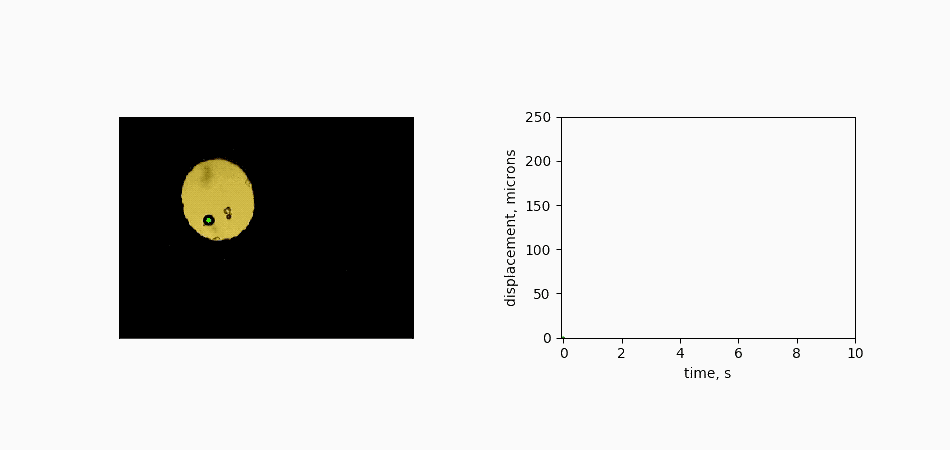

## Portfolio

---

### Recent Projects

[Viewing and segmenting microCT data slices](https://drwrenmontgomery.github.io/microT-sandbox/)

---

[Publication quality spectrum plot with microns and wavenumbers](https://drwrenmontgomery.github.io/micron-wavenumber/)

---
[Tracking a rolling ball in a diamond anvil cell to calculate viscosity](https://drwrenmontgomery.github.io/rolling-sphere)

---
[Platform independent FTIR data presentation and analysis tools](https://drwrenmontgomery.github.io/HiPressureFTIR)

---

Page template forked from <a href="https://github.com/evanca/quick-portfolio">evanca</a>

<!-- Remove above link if you don't want to attibute -->
